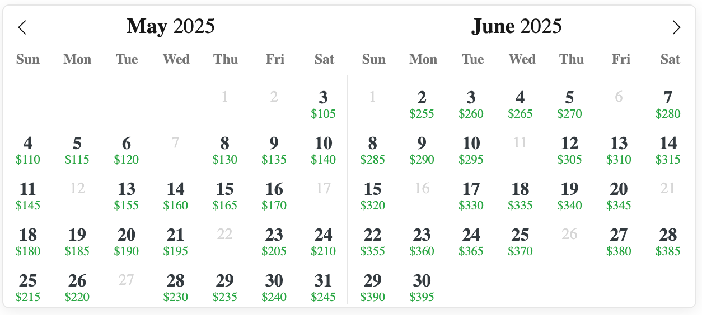

# lodgify-calendar

This project is for developing a AWS Lambda service to consolidate the price and availabilty data from a lodgify listing and display it on a compact calendar.

Like this

## Project contents

This project contains a lambda function in [app.py](lambda_function/app.py) and a test driver [index.html](calendar_frontend/index.html) to execute it.  Instructions for running in a test environment are [provided](tests/README.md).  

Note, there are two `requirements.txt` files.  The one in the `lambda_function` directory, [requirements.txt](lambda_function/requirements.txt) is a minimal version designed for the lambda_function deployment in a container.  The one in this directory, [requirements.txt](requirements.txt) is a full version required to setup the dev/test envionment, run support services, etc.